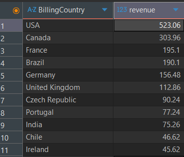
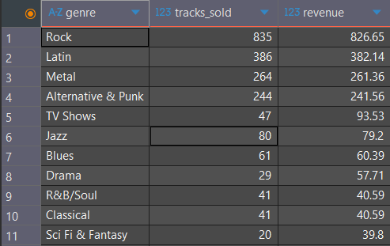
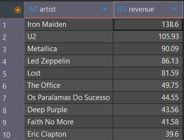

# Chinook-sql-sales-analysis
SQL-based business analysis of a digital music store using the Chinook database.

#  Business Objective

The goal of this project is to analyze sales data from a digital music store so that we can understand revenue distribution, customers' purchasing behavior, product performance, and geography based sales trends. This analysis aims to identify key revenue drivers and highlight opportunities for improving sales performance.

# Chinook Database Sales Analysis (SQL)

## Project Overview

This project analyzes sales data from the **Chinook digital media store database** using SQL.  
The objective of the analysis is to understand customer purchasing behavior, revenue distribution, and product performance across different genres, artists, and geographic regions.

The analysis was conducted using **SQLite in DBeaver**, with SQL queries used to extract insights from relational tables including customers, invoices, tracks, genres, and artists.

This project was completed as part of the **SQL for Data Science course by UC Davis** and expanded into a structured portfolio analysis.

---

## Business Objective

The goal of this analysis is to answer key business questions such as:

- Which countries generate the most revenue?
- Who are the highest spending customers?
- Which music genres drive the most sales?
- Which artists contribute the most to total revenue?
- What tracks are purchased most frequently?

Understanding these patterns can help a digital media store optimize catalog strategy, marketing focus, and customer engagement.

---

## Dataset

The project uses the **Chinook Database**, a sample digital media store dataset that includes:

- Customers
- Invoices and sales transactions
- Tracks and albums
- Artists
- Genres
- Media types

The dataset simulates a real-world digital music store similar to platforms like iTunes.

---

## Tools Used

- SQL (SQLite)
- DBeaver
- GitHub

---

## SQL Analysis

The analysis includes the following areas:

1. Customer and revenue overview  
2. Revenue distribution by country  
3. Top customers by spending  
4. Genre performance analysis  
5. Artist revenue contribution  
6. Track-level sales analysis  

All SQL queries used for this analysis can be found :

```
sql/chinook_analysis.sql
```

---

## Key Insights

- The **United States generates the highest revenue**, followed by Canada and France.
- **Rock music dominates the catalog**, generating significantly more sales than other genres.
- Revenue is **distributed across many customers**, indicating a broad customer base rather than reliance on a few high spenders.
- Classic rock artists such as **Iron Maiden, U2, and Metallica** generate the highest artist revenue.
- Sales are distributed across many tracks, suggesting that **catalog breadth drives overall revenue** rather than a few blockbuster songs.

---

## Sample Results

### Revenue by Country


### Genre Performance


### Top Artists by Revenue


---

## Repository Structure

```
chinook-sql-analysis
│
├── README.md
├── sql
│   └── chinook_analysis.sql
├── screenshots
│   ├── revenue_by_country.png
│   ├── genre_performance.png
│   └── top_artists_revenue.png
└── documentation
```

---

## Author

Data analysis performed using SQL as part of portfolio development and coursework from the **UC Davis SQL for Data Science program**.

